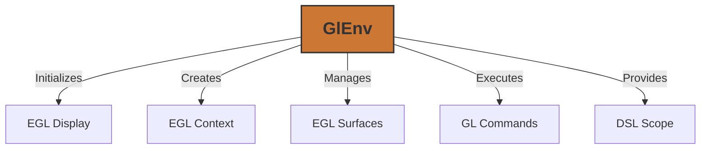

# GlEnv (Graphics Environment)

The `GlEnv` (Graphics Environment) is a core component of KraftShade that manages the OpenGL ES environment and EGL context. It serves as the foundation for all rendering operations in the library.

## Overview

`GlEnv` handles the initialization of EGL, creation of surfaces, and management of the GL context. It provides a structured way to interact with OpenGL ES, ensuring that operations are performed in the correct thread and context.



## Key Components

### EGL Components

- **EGL Display**: The connection to the native display system
- **EGL Config**: The chosen configuration that matches rendering requirements
- **EGL Context**: The OpenGL ES context essential for all rendering operations
- **EGL Surfaces**: Rendering targets (window surfaces, pixel buffers)

### Execution Environment

- **Coroutine Dispatcher**: Ensures GL operations run on the correct thread
- **DSL Scope**: Provides a domain-specific language for easier interaction with GL operations

#### The Importance of the Dispatcher

In OpenGL, a context is bound to a specific thread. This means that all OpenGL operations for a particular context must be performed on the same thread where the context was created. To handle this constraint, KraftShade creates a dedicated coroutine dispatcher that uses a single thread:

```kotlin
private val dispatcher = if (useUnconfinedDispatcher) Dispatchers.Unconfined else
    Executors.newSingleThreadExecutor().asCoroutineDispatcher()
```

This approach ensures that:
- All GL operations are executed on the correct thread
- Developers don't need to worry about thread management when using KraftShade
- The OpenGL context remains valid throughout the application lifecycle

#### Suspend Functions in KraftShade

Most methods in the KraftShade library are defined as suspend functions. This design choice is directly related to the thread constraints of OpenGL:

```kotlin
suspend fun <T> execute(block: suspend GlEnvDslScope.() -> T): T = withContext(dispatcher) {
    makeCurrent()
    executeDeferredTasks()
    block(dslScope)
}
```

By using suspend functions and coroutines:
1. KraftShade can automatically switch to the correct thread for GL operations
2. Developers can write sequential code that appears to run on a single thread
3. The library can manage thread switching transparently
4. Long-running GL operations don't block the main thread

This approach simplifies development while ensuring that all OpenGL operations are performed correctly and efficiently.

## Creating a GlEnv Instance

To create a `GlEnv` instance, you need to provide an Android `Context`:

```kotlin
// Basic initialization
val glEnv = GlEnv(context)

// With additional options
val glEnv = GlEnv(
    context = context,
    useUnconfinedDispatcher = false,  // Use dedicated thread (recommended for most cases)
    enableEglAndroidRecordable = false,  // Enable for video recording
    sharedContext = null  // Optional shared context for resource sharing
)
```

## Executing GL Operations

The `GlEnv` class provides several methods to execute OpenGL operations:

### Using execute()

The `execute()` method ensures that GL operations are performed on the correct thread with the GL context made current:

```kotlin
glEnv.execute {
    // OpenGL operations here
    GLES30.glClearColor(0.0f, 0.0f, 0.0f, 1.0f)
    GLES30.glClear(GLES30.GL_COLOR_BUFFER_BIT)
}
```

### Using use()

The `use()` method is similar to `execute()` but automatically terminates the GL environment when done:

```kotlin
glEnv.use {
    // OpenGL operations here
    // GL environment will be terminated after this block
}
```

### Posting Deferred Tasks

You can post tasks to be executed during the next `execute()` call:

```kotlin
glEnv.post {
    // This will be executed before the next execute() block
    GLES30.glEnable(GLES30.GL_BLEND)
}
```

## Working with Surfaces

`GlEnv` provides methods to create different types of surfaces:

### Window Surfaces

Window surfaces are used for on-screen rendering:

```kotlin
// From SurfaceTexture
val surfaceTexture: SurfaceTexture = ...
val windowSurface = glEnv.createWindowSurface(surfaceTexture)

// From Surface
val surface: Surface = ...
val windowSurface = glEnv.createWindowSurface(surface)
```

### Pixel Buffer Surfaces

Pixel buffer surfaces are used for off-screen rendering:

```kotlin
// Create a pbuffer surface
val size = GlSize(width = 1024, height = 768)
val pbufferSurface = glEnv.createPbufferSurface(size)

// Create a pixel buffer
val pixelBuffer = glEnv.createPixelBuffer(width = 1024, height = 768)
```

## Making a Surface Current

Before performing GL operations on a surface, you need to make it current:

```kotlin
glEnv.makeCurrent(surface)
```

## Swapping Buffers

After rendering to a window surface, you need to swap buffers to display the result:

```kotlin
glEnv.swapBuffers(windowSurface)
```

## Terminating the GL Environment

When you're done with the GL environment, you should terminate it to release resources:

```kotlin
glEnv.terminate()
```

## Integration with KraftShade DSL

`GlEnv` integrates with KraftShade's DSL through the `GlEnvDslScope` class, which provides a more convenient way to work with GL operations:

```kotlin
glEnv.execute {
    // 'this' is a GlEnvDslScope
    
    // Create a pipeline
    val pipeline = pipeline(targetBuffer) {
        // Pipeline setup
    }
    
    // Load a texture from assets
    val texture = loadAssetTexture("textures/sample.jpg")
}
```

## Thread Safety Considerations

OpenGL ES operations must be performed on the thread where the GL context was created. `GlEnv` handles this by using a dedicated dispatcher for GL operations:

- By default, a single-threaded executor is used to ensure all GL operations run on the same thread
- You can use `useUnconfinedDispatcher = true` to run on the calling thread, but this should be used with caution

### Thread Management with Coroutines

The combination of coroutines and a dedicated dispatcher provides several benefits for thread management:

```kotlin
// This will automatically switch to the GL thread
glEnv.execute {
    // All code here runs on the correct GL thread
    GLES30.glClearColor(0.0f, 0.0f, 0.0f, 1.0f)
    GLES30.glClear(GLES30.GL_COLOR_BUFFER_BIT)
}

// This code runs on whatever thread called the function
// No need to worry about switching back
```

This approach allows developers to:
- Write code that appears sequential and simple
- Avoid callback hell or complex thread management
- Safely perform GL operations without worrying about thread boundaries
- Integrate GL operations with other asynchronous code using coroutines

The suspend functions in KraftShade ensure that all GL operations are performed on the correct thread, even when called from different parts of the application or different threads.

## Performance Considerations

- **Context Switching**: Minimize the number of `makeCurrent()` calls, as context switching can be expensive
- **Surface Creation**: Creating surfaces is relatively expensive, so reuse surfaces when possible
- **Termination**: Always terminate the GL environment when done to prevent resource leaks

## Common Pitfalls

- **Using GL Commands Outside Context**: Ensure all GL commands are executed within an `execute()` or `use()` block
- **Resource Leaks**: Failing to terminate the GL environment can lead to resource leaks
- **Thread Issues**: Attempting to use GL commands from multiple threads can cause crashes or undefined behavior

## Related Components

- **GlEnvDslScope**: Provides a DSL for working with the GL environment
- **Pipeline**: Uses GlEnv for executing rendering operations
- **KraftShader**: Requires a GlEnv for initialization and execution
