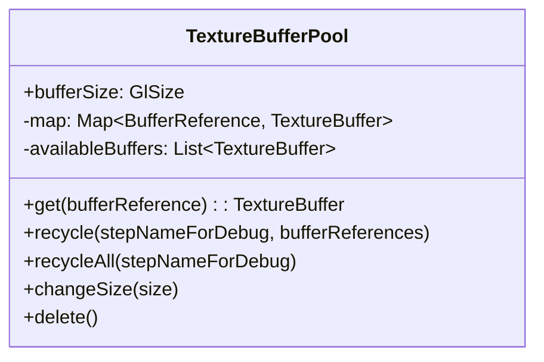
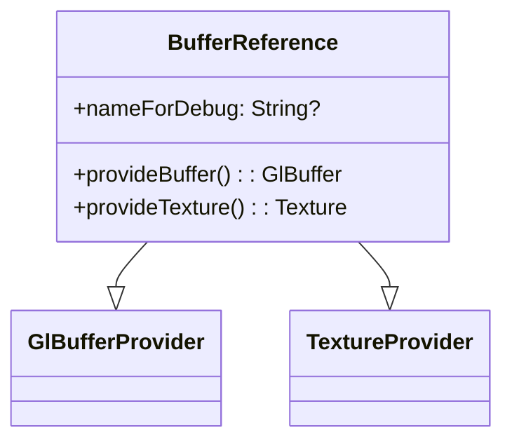

# Buffer Management

KraftShade's pipeline system includes a sophisticated buffer management mechanism that efficiently handles OpenGL texture buffers. This document explains how buffers are managed, tracked, and recycled throughout the pipeline execution process.

## Overview

In graphics processing, texture buffers are used to store intermediate results between shader operations. Creating and destroying these buffers is expensive, so KraftShade implements a buffer pooling system that reuses buffers when possible, significantly improving performance.

The buffer management system consists of three main components:

1. **TextureBufferPool**: A pool that manages the lifecycle of texture buffers
2. **BufferReference**: A handle that references a buffer in the pool
3. **Buffer Collection Mechanism**: A system that tracks buffer usage and recycles buffers when they're no longer needed

## TextureBufferPool

The `TextureBufferPool` is responsible for managing a collection of `TextureBuffer` objects. It provides the following functionality:



### Key Operations

- **Buffer Allocation**: When a `BufferReference` requests a buffer, the pool first checks if there's an available buffer that can be reused. If not, it creates a new buffer.
- **Buffer Recycling**: When a buffer is no longer needed, it's moved from the active map to the available buffers list.
- **Size Management**: All buffers in the pool have the same size. When the size changes, all buffers are deleted and will be recreated with the new size when needed.

### Implementation Details

```kotlin
operator fun get(bufferReference: BufferReference): TextureBuffer {
    return map[bufferReference] ?: run {
        // Try to reuse an available buffer
        availableBuffers
            .removeFirstOrNull()
            ?.let { availableBuffer ->
                map[bufferReference] = availableBuffer
                return availableBuffer
            }

        // Create a new buffer if none are available
        TextureBuffer(bufferSize).also {
            map[bufferReference] = it
        }
    }
}
```

## BufferReference

A `BufferReference` is a handle that represents a buffer in the `TextureBufferPool`. It implements both `GlBufferProvider` and `TextureProvider` interfaces, allowing it to be used in different contexts:



### Usage

`BufferReference` objects are created by the pipeline and used to:

1. **Request Buffers**: When a shader needs a target buffer to render to
2. **Provide Textures**: When a shader needs a texture input from a previous step
3. **Track Buffer Lifecycle**: The pipeline system tracks when each reference is last used

### Implementation Details

```kotlin
class BufferReference internal constructor(
    private val pipeline: Pipeline,
    val nameForDebug: String? = null,
) : GlBufferProvider, TextureProvider {
    override fun provideBuffer(): GlBuffer {
        return pipeline.bufferPool[this]
    }

    override fun provideTexture(): Texture {
        return pipeline.getTextureFromBufferPool(this)
    }
}
```

## Buffer Collection Mechanism

The buffer collection mechanism is a key part of KraftShade's performance optimization. It automatically tracks buffer usage and recycles buffers when they're no longer needed.

### How It Works

1. **Usage Tracking**: When a `BufferReference` is used as a texture input, the pipeline records the step index in `bufferReferenceUsage`.
2. **Automatic Recycling**: After each step, the pipeline checks if any buffers won't be used in future steps and recycles them.
3. **Final Cleanup**: At the end of the pipeline run, all buffers are recycled.

### Implementation Details

```kotlin
// In Pipeline.kt
private fun recycleUnusedBuffers(currentStep: Int) {
    val buffersToRecycle = bufferReferenceUsage.entries
        .filter { (_, lastUsedStepIndex) -> lastUsedStepIndex == currentStep }
        .map { it.key }
        .toTypedArray()

    if (buffersToRecycle.isNotEmpty()) {
        bufferPool.recycle(currentStep.toString(), *buffersToRecycle)
    }
}
```

## Two-Phase Execution and Buffer Management

KraftShade's pipeline execution has two phases that work together with the buffer management system:

### Configuration Phase

During the first run of a pipeline:

1. The pipeline executes each step with `isRenderPhase = false`
2. As steps request texture inputs, the pipeline tracks which `BufferReference` is used in which step
3. This builds a complete map of buffer usage throughout the pipeline

### Render Phase

During subsequent runs:

1. The pipeline executes each step with `isRenderPhase = true`
2. After each step, it checks if any buffers won't be used in future steps
3. Buffers that won't be used again are recycled immediately
4. At the end of the run, all buffers are recycled

## Performance Benefits

This buffer management system provides several performance benefits:

1. **Reduced Memory Usage**: By recycling buffers, the system minimizes the number of texture buffers needed.
2. **Minimized GPU Operations**: Creating and destroying OpenGL textures is expensive. Reusing buffers reduces these operations.
3. **Automatic Cleanup**: Developers don't need to manually manage buffer lifecycles.
4. **Optimized for Complex Pipelines**: The system scales well with pipeline complexity, as buffers are recycled as soon as possible.

## Example: Buffer Lifecycle in a Pipeline

Consider a simple pipeline with three steps:

1. Step 0: Renders to Buffer A
2. Step 1: Uses Buffer A as input, renders to Buffer B
3. Step 2: Uses Buffer B as input, renders to the final output

The buffer lifecycle would be:

1. **Configuration Phase**:
   - Records that Buffer A is last used in Step 1
   - Records that Buffer B is last used in Step 2

2. **Render Phase**:
   - After Step 1: Recycles Buffer A since it won't be used again
   - After Step 2: Recycles Buffer B
   - End of pipeline: All buffers are recycled

This ensures that at any point, only the necessary buffers are allocated, minimizing memory usage and maximizing performance.
