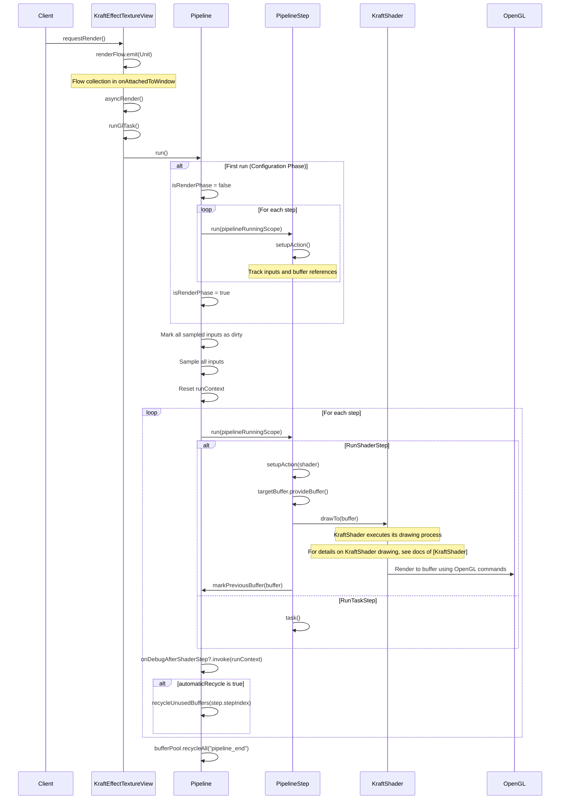

# Pipeline Running Flow

This document explains the execution flow of the KraftShade pipeline system, focusing on what happens after the `requestRender` method is invoked.

## Rendering Flow Sequence Diagram

The following sequence diagram illustrates the complete flow from invoking `requestRender` to the final rendering:

## Behind the Scenes: What Happens After requestRender

When `requestRender()` is called on a `KraftEffectTextureView`, it triggers a series of operations that ultimately result in rendering the pipeline to the screen. Here's a detailed explanation of what happens behind the scenes:

### 1. Request Initiation

- **requestRender()**: The process begins when `requestRender()` is called on a `KraftEffectTextureView`. This method emits a value to a `renderFlow` (a Kotlin Flow).
- **Flow Collection**: In `onAttachedToWindow()`, the view sets up a flow collection that samples the `renderFlow` and calls `asyncRender()` when a value is emitted.
- **asyncRender()**: This method gets the current `effectExecution` (which is a `Pipeline` instance) and runs it using `runGlTask`.
- **runGlTask**: This method in `KraftTextureView` executes the task on the GL thread, ensuring all OpenGL operations happen on the correct thread.

### 2. Pipeline Execution

The `Pipeline.run()` method is the core of the execution process and operates in two distinct phases:

#### Configuration Phase (First Run Only)

During the first run, the pipeline goes through a configuration phase:

- **Setup Steps**: Each pipeline step is executed with `isRenderPhase = false`.
- **Track Inputs**: The pipeline tracks all sampled inputs that will be needed during rendering.
- **Buffer Reference Tracking**: The pipeline records which step each `BufferReference` is last used in, to enable automatic buffer recycling.

#### Render Phase

After configuration, the pipeline enters the render phase:

- **Mark Inputs as Dirty**: All sampled inputs are marked as dirty at the start of the frame.
- **Sample Inputs**: All inputs are sampled to get their current values.
- **Reset Context**: The run context is reset for the new frame.
- **Execute Steps**: Each pipeline step is executed in order:

  **For RunShaderStep:**
  - The `setupAction` is called to configure the shader with current input values.
  - The target buffer is obtained from the buffer provider.
  - The shader's `drawTo` method is called with the buffer.
  - Inside `drawTo`, the shader executes its drawing process. For detailed information about the KraftShader drawing process, see the docs of [KraftShader](../shader-system/kraft-shader.md).
  - The buffer is marked as the previous buffer in the run context.

  **For RunTaskStep:**
  - The task is simply executed.

- **Debug Hook**: After each step, the optional `onDebugAfterShaderStep` hook is called.
- **Buffer Recycling**: If automatic recycling is enabled, buffers that won't be used anymore are recycled.

### 3. Cleanup

- **Final Recycling**: At the end of the pipeline run, all buffers are recycled with `bufferPool.recycleAll("pipeline_end")`.

### Special Considerations

- **Animated Rendering**: In `AnimatedKraftTextureView`, rendering is triggered by the Android Choreographer for frame-synchronized animation.
- **Buffer Management**: The pipeline automatically manages texture buffers, recycling them when they're no longer needed to optimize memory usage.
- **Error Handling**: The pipeline includes error handling to catch and report issues during shader compilation and execution.

## Performance Implications

The pipeline running flow is designed for efficiency:

1. **Deferred Parameter Updates**: Shader parameter updates are queued and applied in batches during draw calls.
2. **Automatic Buffer Recycling**: Texture buffers are automatically recycled when no longer needed.
3. **Input Sampling**: Inputs are sampled only once at the beginning of each frame.
4. **Frame Skipping**: In animated views, if a frame is still rendering when the next frame is requested, the new frame is skipped to prevent backlog.

For more information on optimizing pipeline performance, see the [Performance Optimization](../../advanced-topics/performance-optimization/pipeline-design.md) section.
