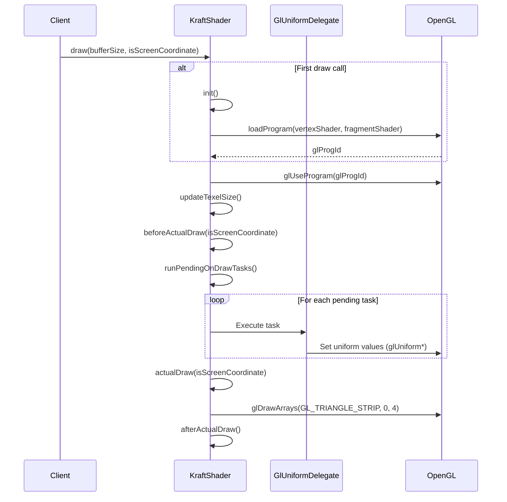

# KraftShader

The `KraftShader` class is the foundation of KraftShade's shader system. It provides a flexible and powerful abstraction over OpenGL shader programs, handling the complexities of shader compilation, parameter management, and rendering.

## Shader Types

KraftShade provides several types of shaders that extend the base `KraftShader` class:

- **KraftShader**: Abstract base class for all shaders
- **TextureInputKraftShader**: Base class for shaders that take a texture input
- **TwoTextureInputKraftShader**: Base class for shaders that take two texture inputs
- **ThreeTextureInputKraftShader**: Base class for shaders that take three texture inputs

For more information about texture handling in shaders, see the [Texture Inputs documentation](./texture-inputs.md).

## Shader Execution Flow

The following sequence diagram illustrates the flow of a shader's draw operation:



### Key Steps in the Draw Process

1. **Initialization (First Draw Only)**:
   - The `init()` method is called on the first draw to compile and link the shader program
   - Vertex and fragment shaders are compiled and linked into a program
   - Attribute locations are retrieved for position and texture coordinates

2. **Program Activation**:
   - The shader program is activated with `glUseProgram`
   - Resolution uniform is set based on the buffer size

3. **Texture Size Update**:
   - For shaders that implement `KraftShaderWithTexelSize`, the texel size is updated

4. **Setup Phase**:
   - `beforeActualDraw` sets up textures and vertex attributes
   - Texture coordinates are bound to the shader

5. **Parameter Updates**:
   - `runPendingOnDrawTasks` executes all queued parameter updates
   - Uniform values are sent to the GPU through `GlUniformDelegate`

6. **Rendering**:
   - `actualDraw` performs the rendering with the updated parameters
   - Vertex positions are bound and the draw call is made

7. **Cleanup**:
   - `afterActualDraw` cleans up resources and disables vertex arrays

## Parameter Handling

KraftShade uses a property delegate system (`GlUniformDelegate`) to manage shader parameters efficiently. This system allows for:

- Declarative parameter definition using Kotlin property delegates
- Deferred parameter updates that are batched and applied during draw calls
- Automatic type conversion for various parameter types (Float, Int, Boolean, vectors, matrices)
- Caching of uniform locations for improved performance

When a shader parameter is updated:
1. The value is stored locally in the delegate
2. A task is queued with the shader's `runOnDraw` method
3. The shader's properties map is updated for serialization purposes

During the draw call, the `runPendingOnDrawTasks` method executes all queued parameter updates, sending the values to the GPU.

For more details on parameter handling, see the [GlUniformDelegate documentation](./gl-uniform-delegate.md).

## Example: OpacityKraftShader

Let's walk through a real example using the `OpacityKraftShader`, which adjusts the opacity of an image:

```kotlin
class OpacityKraftShader(opacity: Float = 1.0f) : TextureInputKraftShader() {
    var opacity: Float by GlUniformDelegate("opacity")

    init {
        this.opacity = opacity
    }

    override fun loadFragmentShader(): String = OPACITY_FRAGMENT_SHADER
}
```

The fragment shader implementation:

```glsl
varying highp vec2 textureCoordinate;

uniform sampler2D inputImageTexture;
uniform lowp float opacity;

void main()
{
    lowp vec4 textureColor = texture2D(inputImageTexture, textureCoordinate);
    
    gl_FragColor = vec4(textureColor.rgb, textureColor.a * opacity);
}
```

### Behind the Scenes Process

1. **Shader Creation**:
   - When an `OpacityKraftShader` is created, the `opacity` property is defined using `GlUniformDelegate`
   - The initial opacity value is set in the constructor, but not yet sent to the GPU

2. **Parameter Updates**:
   - When `shader.opacity = 0.5f` is called:
     - The value is stored in the delegate
     - A task is queued with the shader's `runOnDraw` method
     - The shader's properties map is updated for serialization purposes

3. **Draw Execution**:
   - When `shader.draw()` is called:
     - If this is the first draw, `init()` is called to compile the shader program
     - The shader program is activated with `glUseProgram`
     - `beforeActualDraw` sets up textures and vertex attributes
     - `runPendingOnDrawTasks` executes all queued parameter updates:
       - The opacity value is sent to the GPU with `glUniform1f`
     - `actualDraw` performs the rendering with the updated parameters
     - `afterActualDraw` cleans up resources

This deferred parameter update mechanism is efficient because:
- Multiple parameter changes are batched together
- Updates only happen when needed (during draw calls)
- Redundant updates are avoided by tracking value changes

## Creating Custom Shaders

KraftShade comes with a variety of [built-in shaders](../../built-in-shaders/base-shaders.md) that you can use out of the box. However, you can also create your own custom shaders by extending one of the base shader classes:

```kotlin
class MyCustomShader(
    intensity: Float = 1.0f
) : TextureInputKraftShader() {
    var intensity: Float by GlUniformDelegate("intensity")

    init {
        this.intensity = intensity
    }

    override fun loadFragmentShader(): String = """
        varying highp vec2 textureCoordinate;
        
        uniform sampler2D inputImageTexture;
        uniform lowp float intensity;
        
        void main() {
            lowp vec4 textureColor = texture2D(inputImageTexture, textureCoordinate);
            // Apply custom effect using intensity parameter
            gl_FragColor = textureColor * intensity;
        }
    """
}
```

## Key Methods

- **init()**: Initializes the shader program by compiling and linking the shaders
- **draw()**: Executes the shader with the current parameters
- **loadVertexShader()**: Returns the vertex shader source code (default provided)
- **loadFragmentShader()**: Returns the fragment shader source code (must be implemented)
- **runOnDraw()**: Queues a task to be executed during the next draw call
- **destroy()**: Cleans up OpenGL resources when the shader is no longer needed
