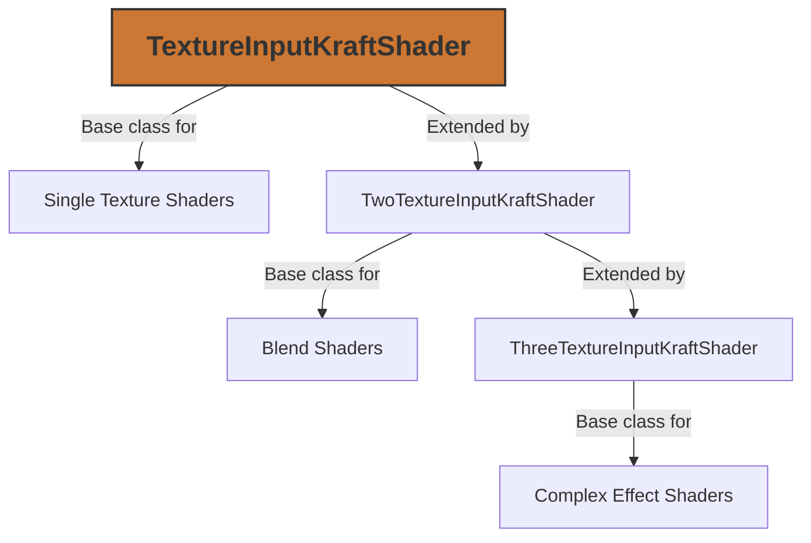

# Texture Inputs

Texture inputs are a fundamental part of KraftShade's shader system, allowing shaders to process image data. This document explains how texture inputs are managed and used within the KraftShade framework.

## Overview

In OpenGL ES, textures are used to provide image data to shaders. KraftShade provides a structured way to manage these textures through its texture input system. This system handles:

- Binding textures to shader programs
- Managing texture coordinates
- Providing texture size information to shaders
- Supporting multiple texture inputs for complex effects



## Texture Input Classes Hierarchy

KraftShade provides a hierarchy of classes for handling different numbers of texture inputs:

### TextureInputKraftShader

The base class for shaders that require a single texture input. It provides:

- Methods to set and get the input texture
- Automatic binding of the texture to the shader program
- Passing texture size to the shader as a uniform

```kotlin
abstract class TextureInputKraftShader(
    samplerUniformName: String = "inputImageTexture",
    sizeUniformName: String = "textureSize",
) : KraftShader() {
    // Implementation details
}
```

### TwoTextureInputKraftShader

Extends `TextureInputKraftShader` to support two texture inputs. This is commonly used for blend operations, lookup tables, and other effects that require two images.

```kotlin
abstract class TwoTextureInputKraftShader(
    samplerUniformName: String = "inputImageTexture",
    sizeUniformName: String = "textureSize",
    secondTextureSampleName: String = "inputImageTexture2",
    secondTextureSizeUniformName: String = "textureSize2",
) : TextureInputKraftShader(samplerUniformName, sizeUniformName) {
    // Implementation details
}
```

### ThreeTextureInputKraftShader

Extends `TwoTextureInputKraftShader` to support three texture inputs. This is used for complex effects that require multiple image sources.

```kotlin
abstract class ThreeTextureInputKraftShader(
    samplerUniformName: String = "inputImageTexture",
    sizeUniformName: String = "textureSize",
    secondTextureSampleName: String = "inputImageTexture2",
    secondTextureSizeUniformName: String = "textureSize2",
    thirdTextureSampleName: String = "inputImageTexture3",
    thirdTextureSizeUniformName: String = "textureSize3",
) : TwoTextureInputKraftShader(
    // Parameters
) {
    // Implementation details
}
```

## KraftShaderTextureInput

The `KraftShaderTextureInput` class is the core component that manages texture binding and uniform handling for shader texture inputs.

```kotlin
class KraftShaderTextureInput(
    val textureIndex: Int,
    samplerUniformName: String = "inputImageTexture${textureIndex + 1}",
    sizeUniformName: String = "textureSize${textureIndex + 1}",
    required: Boolean = true,
) {
    // Implementation details
}
```

Key features:
- Manages texture binding to specific texture units
- Handles uniform setting for sampler and texture size
- Provides a property delegate for texture access

## Texture and TextureProvider

KraftShade uses two key interfaces for texture management:

### Texture

The `Texture` abstract class represents an OpenGL texture:

```kotlin
abstract class Texture {
    var textureId: Int
    abstract val size: GlSize
    
    fun isValid(): Boolean
    suspend fun delete()
    fun getBitmap(): Bitmap
    // Other methods
}
```

### TextureProvider

The `TextureProvider` interface is used to provide textures to shaders:

```kotlin
fun interface TextureProvider {
    fun provideTexture(): Texture
}
```

This interface allows for dynamic texture generation or loading, making it possible to:
- Load textures from assets
- Generate textures procedurally
- Update textures dynamically

## Texture Implementations

KraftShade provides several implementations of the `Texture` class:

### LoadedTexture

Used for textures loaded from bitmaps:

```kotlin
class LoadedTexture(
    val name: String? = null
) : Texture() {
    fun load(bitmap: Bitmap)
    // Other methods
}
```

### TextureBuffer

Used for render targets and intermediate textures in a pipeline:

```kotlin
// Example usage
val textureBuffer = TextureBuffer(GlSize(width, height))
```

## Using Texture Inputs in Shaders

### Basic Usage with TextureInputKraftShader

```kotlin
class GrayscaleKraftShader : TextureInputKraftShader() {
    override fun loadFragmentShader(): String = """
        precision mediump float;
        varying vec2 textureCoordinate;
        uniform sampler2D inputImageTexture;
        
        void main() {
            vec4 color = texture2D(inputImageTexture, textureCoordinate);
            float gray = dot(color.rgb, vec3(0.299, 0.587, 0.114));
            gl_FragColor = vec4(vec3(gray), color.a);
        }
    """
}
```

### Using TwoTextureInputKraftShader

```kotlin
class BlendKraftShader : TwoTextureInputKraftShader() {
    var mixturePercent: Float by GlUniformDelegate("mixturePercent")
    
    init {
        mixturePercent = 0.5f
    }
    
    override fun loadFragmentShader(): String = """
        precision mediump float;
        varying vec2 textureCoordinate;
        varying vec2 textureCoordinate2;
        uniform sampler2D inputImageTexture;
        uniform sampler2D inputImageTexture2;
        uniform float mixturePercent;
        
        void main() {
            vec4 color1 = texture2D(inputImageTexture, textureCoordinate);
            vec4 color2 = texture2D(inputImageTexture2, textureCoordinate2);
            gl_FragColor = mix(color1, color2, mixturePercent);
        }
    """
}
```

## Setting Textures in Shaders

There are multiple ways to set textures in KraftShade shaders:

### Direct Texture Setting

```kotlin
val shader = GrayscaleKraftShader()
shader.setInputTexture(texture)
```

### Using TextureProvider

```kotlin
val textureProvider = sampledBitmapTextureProvider("myTexture") {
    // Return a bitmap here
    loadBitmap()
}
shader.setInputTexture(textureProvider)
```

### In Pipeline DSL

```kotlin
pipeline(targetBuffer) {
    step(GrayscaleKraftShader()) {
        // The input texture is automatically set from the previous step
    }
    
    stepWithInputTexture(BlendKraftShader()) {
        // Set the second texture
        setSecondInputTexture(someTexture)
    }
}
```

## Texture Coordinate Transformation

TwoTextureInputKraftShader and ThreeTextureInputKraftShader support texture coordinate transformation matrices:

```kotlin
val blendShader = BlendKraftShader()

// Transform the second texture's coordinates
blendShader.updateTexture2SamplingTransformMatrix {
    setScale(2.0f, 2.0f)  // Scale the texture coordinates
    setTranslation(-0.5f, -0.5f)  // Translate the texture coordinates
}
```

This is useful for:
- Scaling textures
- Rotating textures
- Translating textures
- Creating effects like tiling or mirroring

## Best Practices

### Texture Management

- **Reuse textures** when possible to avoid creating new OpenGL textures
- **Delete textures** when they are no longer needed to free GPU memory
- **Use TextureProvider** for dynamic texture generation or loading

### Performance Considerations

- **Minimize texture size** to reduce memory usage and improve performance
- **Use appropriate texture formats** for your needs
- **Consider mipmap generation** for textures that will be scaled down

### Shader Development

- **Use the appropriate base class** based on the number of textures needed
- **Follow the naming conventions** for uniform names
- **Handle texture coordinates correctly** in your fragment shader

## Common Pitfalls

- **Not binding textures** before drawing
- **Using incorrect texture coordinates** in the fragment shader
- **Not handling texture size** correctly
- **Memory leaks** from not deleting textures

## Related Components

- **KraftShader**: The base class for all shaders in KraftShade
- **GlUniformDelegate**: Used for handling uniform values in shaders
- **Pipeline**: Used for chaining multiple shader operations
