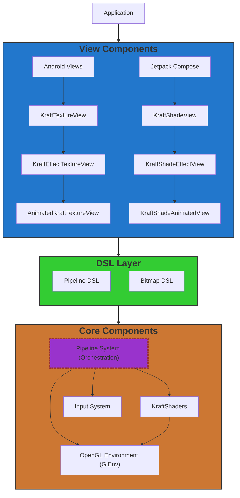
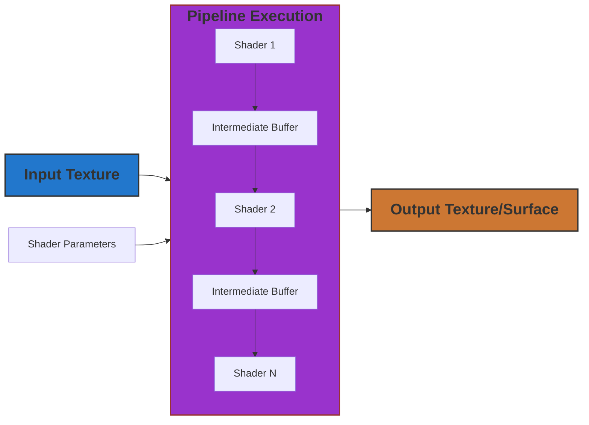

# Architecture Overview

KraftShade is built with a modular, layered architecture that provides flexibility, performance, and ease of use. This document provides a high-level overview of the KraftShade architecture, its core components, and how they interact.

## High-Level Architecture

KraftShade's architecture is organized into several key layers:

## Core Components

### OpenGL Environment (GlEnv)

The OpenGL Environment is the foundation of KraftShade, providing a managed context for OpenGL operations:

- Handles OpenGL context creation and management
- Manages the lifecycle of OpenGL resources
- Provides utilities for common OpenGL operations
- Ensures thread-safety for OpenGL operations

For more details on the OpenGL Environment, see the [GlEnv documentation](../core-components/glenv.md).

### Shader System

The Shader System is responsible for managing and executing GLSL shaders. It provides a flexible and efficient way to apply various effects to textures.

KraftShade provides several basic types of shaders:

- **KraftShader**: Abstract base class for all shaders
- **TextureInputKraftShader**: Base class for shaders that take a texture input
- **TwoTextureInputKraftShader**: Base class for shaders that take two texture inputs
- **ThreeTextureInputKraftShader**: Base class for shaders that take three texture inputs

For more details on the shader system, including execution flow and parameter handling, see the [KraftShader documentation](../core-components/shader-system/kraft-shader.md).

### Pipeline System

The Pipeline System orchestrates the execution of shaders in a defined sequence:

The Pipeline System consists of several key components that work together to execute shader operations in a defined sequence:

**Key Components:**

- **EffectExecution**: An interface that defines the contract for executing effects, with methods for running, destroying, and handling buffer size changes.

- **Pipeline**: The main implementation class that executes a sequence of shader operations. It maintains a list of pipeline steps and manages a texture buffer pool for efficient resource usage.

- **PipelineStep**: An abstract base class for all pipeline steps, defining how each step runs within the pipeline scope.

- **RunShaderStep**: A concrete implementation of PipelineStep that runs a specific shader.

- **RunTaskStep**: A concrete implementation of PipelineStep that runs a custom task.

- **TextureBufferPool**: A utility class that manages and recycles texture buffers to improve performance and reduce memory allocation.

**Relationships:**

- Pipeline implements the EffectExecution interface
- RunShaderStep and RunTaskStep extend the PipelineStep abstract class
- Pipeline contains and manages multiple PipelineStep instances
- Pipeline uses TextureBufferPool for buffer management

Key components:

- **EffectExecution**: Interface for executing effects
- **Pipeline**: Main class for executing a sequence of shader operations
- **PipelineStep**: Abstract base class for pipeline steps
- **RunShaderStep**: Step that runs a shader
- **RunTaskStep**: Step that runs a custom task
- **TextureBufferPool**: Manages and recycles texture buffers

For more details on the pipeline system, see the [Pipeline Running Flow documentation](../core-components/pipeline-system/pipeline-running-flow.md) and [Buffer Management documentation](../core-components/pipeline-system/buffer-management.md).

### Input System

The Input System provides a way to feed dynamic values into shaders:

- Supports time-based animations
- Allows for user interaction inputs
- Enables dynamic parameter changes

For more details on the Input System, see the [Input System documentation](../core-components/input-system.md).

## DSL Layer

KraftShade provides a Kotlin DSL for building shader pipelines:

KraftShade provides a Kotlin DSL for building shader pipelines with a clean and intuitive API. The DSL layer consists of several scope classes that provide a structured way to define pipeline operations:

**Key Components:**

- **BasePipelineSetupScope**: The abstract base scope for all pipeline setup operations, providing common functionality like adding shader steps.

- **GraphPipelineSetupScope**: A specialized scope for setting up graph pipelines, with additional methods for connecting shader inputs to specific textures.

- **SerialTextureInputPipelineScope**: A scope for setting up serial pipelines, with methods optimized for linear processing chains.

- **KraftBitmapDslScope**: A scope specifically for creating bitmaps with effects, providing a convenient API for bitmap processing.

**Relationships:**

- GraphPipelineSetupScope and SerialTextureInputPipelineScope both extend BasePipelineSetupScope
- Each scope provides specialized methods appropriate for its pipeline type

Key components:

- **BasePipelineSetupScope**: Base scope for pipeline setup
- **GraphPipelineSetupScope**: Scope for setting up graph pipelines
- **SerialTextureInputPipelineScope**: Scope for setting up serial pipelines
- **KraftBitmapDslScope**: Scope for creating bitmaps with effects

For more details on the DSL layer, see the [Pipeline DSL Introduction](../pipeline-dsl/introduction.md).

## View Components

KraftShade provides view components for both traditional Android Views and Jetpack Compose:

### Android Views

KraftShade provides a hierarchy of view components for traditional Android Views:

**Key Components:**

- **KraftTextureView**: The base view for OpenGL rendering, providing core functionality for executing OpenGL tasks and managing the rendering lifecycle.

- **KraftEffectTextureView**: Extends KraftTextureView to add support for rendering shader effects, with methods for setting effects and requesting renders.

- **AnimatedKraftTextureView**: Further extends KraftEffectTextureView to add support for animated effects, with methods for controlling playback.

**Relationships:**

- KraftEffectTextureView extends KraftTextureView
- AnimatedKraftTextureView extends KraftEffectTextureView
- Each view in the hierarchy adds more specialized functionality while maintaining the capabilities of its parent

Key components:

- **KraftTextureView**: Base view for OpenGL rendering
- **KraftEffectTextureView**: View for rendering shader effects
- **AnimatedKraftTextureView**: View for rendering animated shader effects

For more details on Android Views, see the [Android Views documentation](../view-components/android-views/kraft-texture-view.md).

### Jetpack Compose

For Jetpack Compose integration, KraftShade provides a similar hierarchy of state classes:

**Key Components:**

- **KraftShadeBaseState**: The base state for Compose integration, providing core functionality for executing OpenGL tasks and managing the rendering lifecycle.

- **KraftShadeEffectState**: Extends KraftShadeBaseState to add support for rendering shader effects, with methods for setting effects and requesting renders.

- **KraftShadeAnimatedState**: Further extends KraftShadeEffectState to add support for animated effects, with methods for controlling playback.

**Relationships:**

- KraftShadeEffectState extends KraftShadeBaseState
- KraftShadeAnimatedState extends KraftShadeEffectState
- Each state in the hierarchy adds more specialized functionality while maintaining the capabilities of its parent
- These state classes are used by the corresponding Compose components (KraftShadeView, KraftShadeEffectView, KraftShadeAnimatedView)

Key components:

- **KraftShadeBaseState**: Base state for Compose integration
- **KraftShadeEffectState**: State for rendering shader effects in Compose
- **KraftShadeAnimatedState**: State for rendering animated shader effects in Compose

For more details on Jetpack Compose integration, see the [Jetpack Compose documentation](../view-components/jetpack-compose/kraft-shade-view.md).

## Data Flow

The following diagram illustrates the typical data flow in a KraftShade application:

1. Input textures (from images, camera, etc.) enter the pipeline
2. Shaders process the textures, applying various effects
3. Intermediate buffers store results between shader steps
4. The final output is rendered to a texture or surface
5. The view component displays the result

## Resource Management

KraftShade efficiently manages OpenGL resources:

- **Automatic Buffer Recycling**: Intermediate buffers are automatically recycled
- **Texture Reuse**: Textures are reused when possible to reduce memory allocation
- **Proper Cleanup**: Resources are properly released when no longer needed
- **Thread Safety**: OpenGL operations are performed on the appropriate thread

## Conclusion

KraftShade's architecture is designed to provide a flexible, efficient, and easy-to-use framework for GPU-accelerated graphics processing on Android. The modular design allows for easy extension and customization, while the DSL provides a clean and intuitive API for building complex shader pipelines.

For more details on specific components, refer to the corresponding sections in the documentation.
