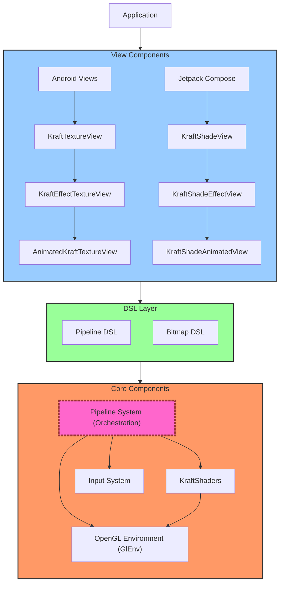
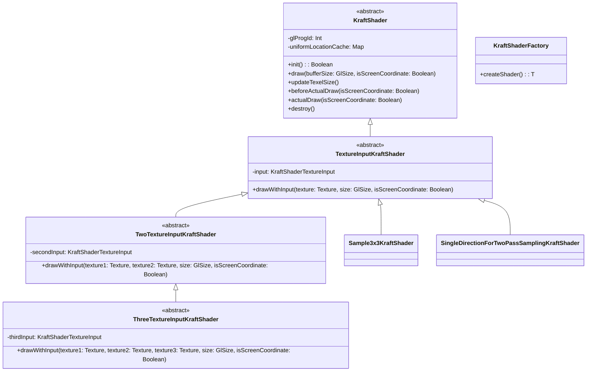
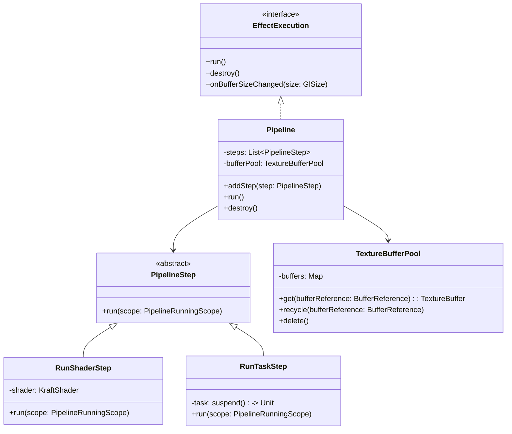
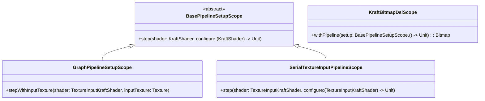
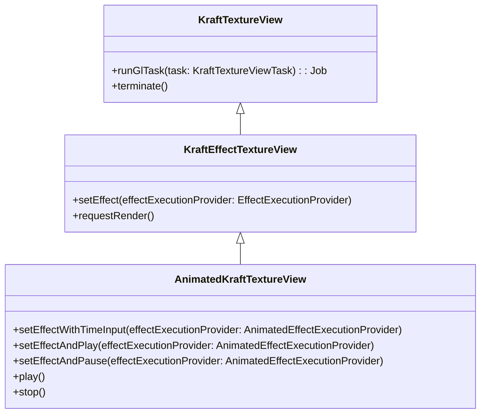
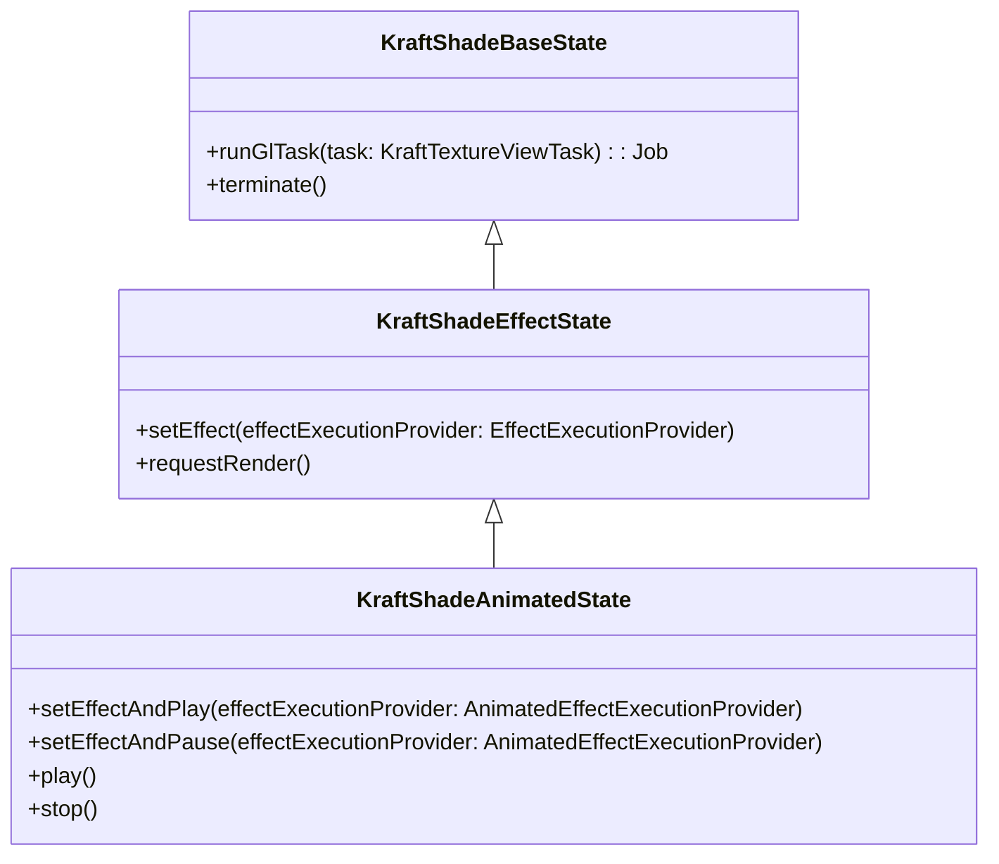
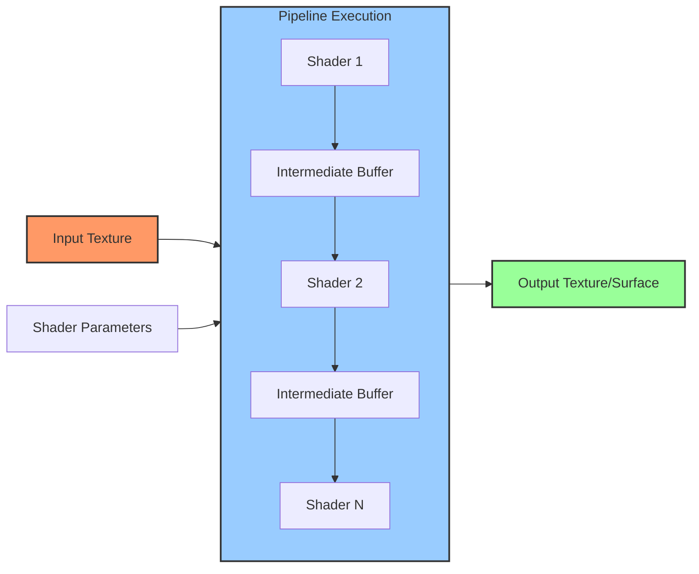

# Architecture Overview

KraftShade is built with a modular, layered architecture that provides flexibility, performance, and ease of use. This document provides a high-level overview of the KraftShade architecture, its core components, and how they interact.

## High-Level Architecture

KraftShade's architecture is organized into several key layers:

## Core Components

### OpenGL Environment (GlEnv)

The OpenGL Environment is the foundation of KraftShade, providing a managed context for OpenGL operations:

- Handles OpenGL context creation and management
- Manages the lifecycle of OpenGL resources
- Provides utilities for common OpenGL operations
- Ensures thread-safety for OpenGL operations

### Shader System

The Shader System is responsible for managing and executing GLSL shaders:

Key components:

- **KraftShader**: Abstract base class for all shaders
- **TextureInputKraftShader**: Base class for shaders that take a texture input
- **TwoTextureInputKraftShader**: Base class for shaders that take two texture inputs
- **ThreeTextureInputKraftShader**: Base class for shaders that take three texture inputs
- **KraftShaderFactory**: Factory for creating shader instances

### Pipeline System

The Pipeline System orchestrates the execution of shaders in a defined sequence:

Key components:

- **EffectExecution**: Interface for executing effects
- **Pipeline**: Main class for executing a sequence of shader operations
- **PipelineStep**: Abstract base class for pipeline steps
- **RunShaderStep**: Step that runs a shader
- **RunTaskStep**: Step that runs a custom task
- **TextureBufferPool**: Manages and recycles texture buffers

### Input System

The Input System provides a way to feed dynamic values into shaders:

- Supports time-based animations
- Allows for user interaction inputs
- Enables dynamic parameter changes

## DSL Layer

KraftShade provides a Kotlin DSL for building shader pipelines:

Key components:

- **BasePipelineSetupScope**: Base scope for pipeline setup
- **GraphPipelineSetupScope**: Scope for setting up graph pipelines
- **SerialTextureInputPipelineScope**: Scope for setting up serial pipelines
- **KraftBitmapDslScope**: Scope for creating bitmaps with effects

## View Components

KraftShade provides view components for both traditional Android Views and Jetpack Compose:

### Android Views

Key components:

- **KraftTextureView**: Base view for OpenGL rendering
- **KraftEffectTextureView**: View for rendering shader effects
- **AnimatedKraftTextureView**: View for rendering animated shader effects

### Jetpack Compose

Key components:

- **KraftShadeBaseState**: Base state for Compose integration
- **KraftShadeEffectState**: State for rendering shader effects in Compose
- **KraftShadeAnimatedState**: State for rendering animated shader effects in Compose

## Data Flow

The following diagram illustrates the typical data flow in a KraftShade application:

1. Input textures (from images, camera, etc.) enter the pipeline
2. Shaders process the textures, applying various effects
3. Intermediate buffers store results between shader steps
4. The final output is rendered to a texture or surface
5. The view component displays the result

## Resource Management

KraftShade efficiently manages OpenGL resources:

- **Automatic Buffer Recycling**: Intermediate buffers are automatically recycled
- **Texture Reuse**: Textures are reused when possible to reduce memory allocation
- **Proper Cleanup**: Resources are properly released when no longer needed
- **Thread Safety**: OpenGL operations are performed on the appropriate thread

## Conclusion

KraftShade's architecture is designed to provide a flexible, efficient, and easy-to-use framework for GPU-accelerated graphics processing on Android. The modular design allows for easy extension and customization, while the DSL provides a clean and intuitive API for building complex shader pipelines.

For more details on specific components, refer to the corresponding sections in the documentation.
