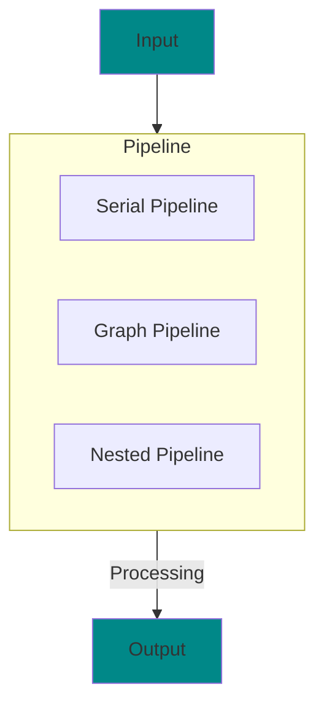

# Overview

## What is KraftShade?

KraftShade is a modern, flexible GPU-accelerated graphics library for Android that enables developers to create complex visual effects, filters, and animations. Built on OpenGL ES, KraftShade provides a powerful yet intuitive API for implementing high-performance graphics processing in Android applications.

The library is designed to address the limitations of existing graphics libraries while providing a Kotlin-first approach that integrates seamlessly with modern Android development practices, including Jetpack Compose.

## Key Features

### Flexible Pipeline Architecture

KraftShade's core strength lies in its flexible pipeline architecture that allows for both simple serial processing and complex graph-based shader pipelines:



- **Serial Pipelines**: Chain multiple effects in sequence
- **Graph Pipelines**: Create non-linear processing flows with multiple branches
- **Nested Pipelines**: Combine different pipeline types for complex effects

### Kotlin-First Design

KraftShade embraces modern Kotlin features to provide an intuitive and type-safe API:

```kotlin
// Creating a simple effect with KraftShade
pipeline(windowSurface) {
    serialSteps(
        inputTexture = bitmap.asTexture(),
        targetBuffer = windowSurface,
    ) {
        step(SaturationKraftShader()) {
            saturation = 1.5f
        }

        step(ContrastKraftShader()) {
            contrast = 1.2f
        }
    }
}
```

### Comprehensive View Components

KraftShade provides ready-to-use view components for both traditional Android Views and Jetpack Compose:

- **Android Views**:
  - `KraftTextureView`: Base OpenGL rendering view
  - `KraftEffectTextureView`: Effect-enabled view
  - `AnimatedKraftTextureView`: Animation support

- **Jetpack Compose**:
  - `KraftShadeView`: Compose wrapper for KraftTextureView
  - `KraftShadeEffectView`: Compose wrapper for KraftEffectTextureView
  - `KraftShadeAnimatedView`: Compose wrapper for AnimatedKraftTextureView

### Built-in Shader Library

KraftShade comes with a comprehensive set of built-in shaders for common visual effects:

- Color manipulation (saturation, contrast, hue, etc.)
- Blur and distortion effects
- Edge detection and convolution operations
- Blending modes
- Artistic effects
- Alpha and transparency handling

### Animation Support

Create dynamic, time-based animations with KraftShade's animation system:

```kotlin
// Animated saturation effect
val saturationInput = timeInput
    .bounceBetween(0f, 2f)
    .withDuration(2000)

pipeline(windowSurface) {
    serialSteps(bitmap.asTexture(), windowSurface) {
        step(SaturationKraftShader()) { shader ->
            shader.saturation = saturationInput.get()
        }
    }
}
```

### Efficient Resource Management

KraftShade handles OpenGL resource management automatically:

- Automatic buffer recycling
- Texture reuse optimization
- Proper cleanup of OpenGL resources
- Thread-safe OpenGL context handling

## Use Cases

KraftShade is ideal for a wide range of applications:

- **Photo Editing Apps**: Apply filters and effects to images
- **Video Processing**: Real-time video effects and filters
- **Creative Tools**: Drawing and artistic applications
- **UI Effects**: Add visual flair to your app's interface
- **Augmented Reality**: Enhance camera feeds with effects
- **Data Visualization**: GPU-accelerated rendering of complex data

## Getting Started

Ready to start using KraftShade? Check out the [Installation](../getting-started/installation.md) guide to add KraftShade to your project, then follow the [Quick Start Guide](../getting-started/quick-start-guide.md) to create your first effect.

For a deeper understanding of why KraftShade was created and how it compares to alternatives, see [Why KraftShade](./why-kraftshade.md).