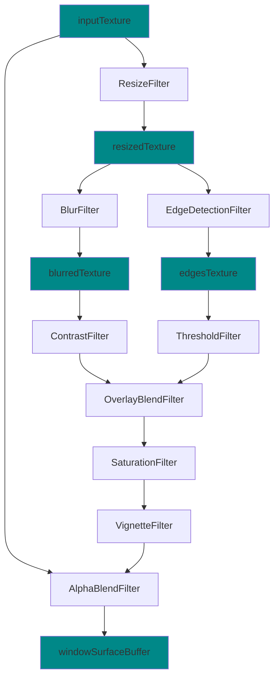

# Why KraftShade

## Understanding GPUImage

[GPUImage](https://github.com/CyberAgent/android-gpuimage) has been a popular library for applying GPU-accelerated filters to images and videos on Android. It provides a simple way to apply various filters to images and videos using OpenGL ES 2.0.

GPUImage is still quite effective if you only need a simple pipeline that is serial (one filter after another) and all filters take only one input texture. This is achieved through GPUImageFilterGroup, which essentially implements a ping-pong buffer mechanism.

For example, a typical GPUImage pipeline might look like this:

```java
GPUImageFilterGroup filterGroup = new GPUImageFilterGroup();
filterGroup.addFilter(new GPUImageSaturationFilter(1.5f));
filterGroup.addFilter(new GPUImageContrastFilter(1.2f));
filterGroup.addFilter(new GPUImageBrightnessFilter(0.1f));
gpuImage.setFilter(filterGroup);
```

## Limitations of GPUImage

While GPUImage works well for simple use cases, it has several limitations:

1. **Inflexible Pipeline Architecture**
   - Limited to single serial pipeline due to its design
   - Cannot easily reuse the output of a specific shader in multiple steps
   - No support for complex graph-based pipelines

2. **Java-centric Design**
   - Lacks Kotlin idioms and modern language features
   - No coroutines support for thread (EGLContext) based operations

3. **Limited View Component Support**
   - Minimal integration with modern UI frameworks
   - No built-in support for Jetpack Compose

4. **Development Challenges**
   - Insufficient error handling and debugging capabilities
   - Limited control over resource allocation
   - No active maintenance since 2021

## KraftShade's Advantages

KraftShade was designed to address these limitations while providing a modern, flexible approach to GPU-accelerated graphics on Android.

### Complex Pipeline Support

Unlike GPUImage, KraftShade can create very complex pipelines. It allows you to reuse the output of a specific shader in multiple steps, creating non-linear processing flows that would be difficult or impossible with GPUImage.

For example, here's a complex effect pipeline that would be challenging to implement with GPUImage but is straightforward with KraftShade:



In this pipeline, the resized texture is used in two separate processing branches, and the results are later combined. This type of non-linear processing is a natural fit for KraftShade's architecture.

### Simplified Serial Pipelines

If you only need a simple serial pipeline like what GPUImage provides, KraftShade offers the `serialSteps` feature to make pipeline configuration easier:

```kotlin
pipeline(windowSurface) {
    serialSteps(
        inputTexture = bitmap.asTexture(),
        targetBuffer = windowSurface,
    ) {
        step(SaturationKraftShader()) {
            saturation = sampledInput { saturation }
        }

        step(HueKraftShader()) {
            setHueInDegree(sampledInput { hue })
        }
    }
}
```

### Jetpack Compose Integration

KraftShade provides several Jetpack Compose views that you can easily integrate with your Compose UI:

```kotlin
@Composable
fun MyEffect() {
    val state = rememberKraftShadeAnimatedState()
    var aspectRatio by remember { mutableFloatStateOf(1f) }

    KraftShadeAnimatedView(
        modifier = Modifier
            .fillMaxWidth()
            .aspectRatio(aspectRatio),
        state = state
    )

    LaunchedEffect(Unit) {
        state.setEffectAndPlay { windowSurface, timeInput ->
            val bitmap = context.loadBitmapFromAsset("sample/cat.jpg")
            aspectRatio = bitmap.width.toFloat() / bitmap.height

            val saturationInput = timeInput
                .bounceBetween(0f, 1f)

            pipeline(windowSurface) {
                serialSteps(bitmap.asTexture(), windowSurface) {
                    step(SaturationKraftShader()) { shader ->
                        shader.saturation = saturationInput.get()
                    }
                }
            }
        }
    }
}
```

The animated view gives you access to a `timeInput` parameter that you can use to create time-based animations and effects.

### Modern Architecture

KraftShade is built with modern Android development in mind:

- **Kotlin-first design** with coroutines support
- **Easy to use DSL** for pipeline construction
- **Type-safe builder pattern**
- **Automatic resource cleanup**
- **Efficient buffer management** with automatic recycling

## When to Choose KraftShade

KraftShade is the right choice when:

1. You need complex, non-linear shader pipelines
2. You want to integrate GPU-accelerated graphics with Jetpack Compose
3. You need animation support for your effects
4. You want a modern, Kotlin-first API with coroutines support
5. You need better debugging and error handling for shader development

Even for simpler use cases, KraftShade's modern architecture and active development make it a compelling alternative to GPUImage for new Android projects.
